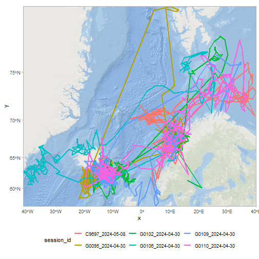
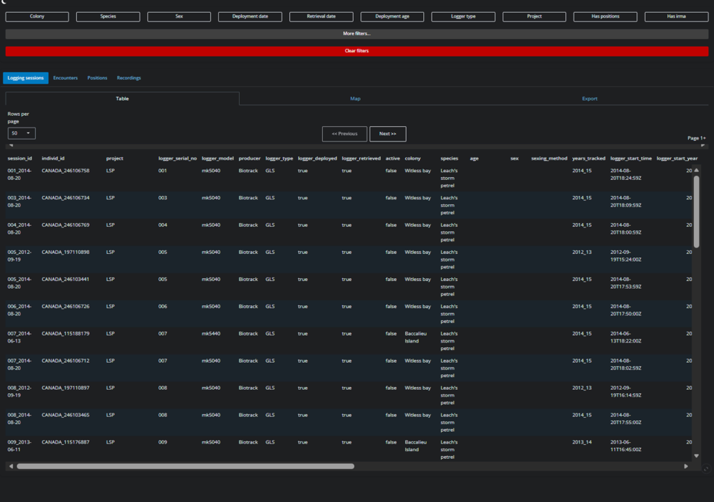

This article will show you how to use the seatrackR data package to connect to the SEATRACK database and use some basic functions to fetch data. 

# Installing seatrackR

seatrackR must be installed from github. We reccomend using the `pak` package for this.


``` r
pak::pkg_install("NINAnor/seatrackR")
```

You can also use the older devtools::install_github function:


``` r
devtools::install_github("NINAnor/seatrackR")
```

Once installed, you can load the package with


``` r
library(seatrackR)
```

# Connecting to the SEATRACK database.

You can connect to the SEATRACK database using the `connectSeatrack()` function.

The first time you need to connect, you'll need to enter your credentials. This should be done in the **R console not an R script**. This is to prevent credentials being leaked.

You can either write your username and credentials as arguments in the function:


``` r
connectSeatrack("my_username", "my_password")
```

Or you can call the function bare, with no arguments, which will then give you an interactive prompt in the console:


``` r
connectSeatrack()
```

If this produces no errors, you are succesfully connected to the database. 

## Credential management

By default, using this function will store your credentials in your project .renviron file.
This means you will not need to type in your credentials next time you connect. Any scripts run in this project can simply call the function.


``` r
connectSeatrack()
```

If you have input your credentials wrongly, you can update  the stored credentials  by calling `connectSeatrack()` with arguments:


``` r
connectSeatrack("my_username", "my_password")
```

or you can use the underlying function for saving credentials, `set_credentials_renviron()`:


``` r
set_credentials_renviron() # With no arguments, will prompt interactively.
# OR
set_credentials_renviron("my_username", "my_password")
```

## Changing your password

If this is your first time connecting, you will have been assigned a temporary password by the administrator. You can change this using `changeSeatrackPassword()`. Again, this should **never be stored in a script.** Run it only in the console. By default, this function will automatically update your stored credentials for this project.


``` r
changeSeatrackPassword() # With no arguments, will prompt interactively.
# OR
changeSeatrackPassword("my_super_secure_new_password")
```

```
## [1] "Wrote credentials to .Renviron"
```

```
## [1] "Password succesfully changed, you have been reconnected."
```

# Some key functions

Having connected to the database, you can now use the package functions to download some data.

## Explore metadata

### Colonies/locations

We can view all available SEATRACK colonies using 


``` r
all_colonies <- getColonies()
head(all_colonies)
```

```
##                                     id      lat       lon colony_int_name colony_nat_name lme_id
## 1 a0755af6-5eae-11ee-a646-005056b165f3 53.41200   6.51600       Groningen       Groningen     NA
## 2 b7c23d4e-0bf0-11e8-82b0-005056b165f3 64.22476 -21.86463        Faxaflói        Faxaflói     51
## 3 a38de81c-5ea8-11ee-a646-005056b165f3 55.20000  15.00000        Bornholm        Bornholm      1
## 4 43e4779a-5eb3-11ee-a646-005056b165f3 54.54000  -8.39000     Donegal Bay     Donegal Bay      6
## 5 b806e594-8645-11ef-847f-005056b165f3 48.74972 -69.03519       Île Laval       Île Laval      5
## 6 518444e2-296a-11f0-9d0f-005056b165f3 76.66500  25.34500           Hopen           Hopen     54
##   country   safe_name
## 1    <NA>   groningen
## 2    <NA>     faxafli
## 3    <NA>    bornholm
## 4    <NA> donegal_bay
## 5    <NA>    le_laval
## 6    <NA>       hopen
```

We can also get all locations, which can be finer scale areas within/attached to SEATRACK colonies.


``` r
all_locations <- getColonies(allLocations = TRUE)
head(all_locations)
```

```
##                                     id   location_name colony_int_name    lat     lon
## 1 518f8f7a-9f17-11e9-8410-005056b165f3         Kippaku         Kippaku 73.717 -56.633
## 2 6a233492-9f17-11e9-8410-005056b165f3   Little Saltee   Little Saltee 52.133  -6.617
## 3 6a23bbba-9f17-11e9-8410-005056b165f3         Rathlin         Rathlin 55.298  -6.280
## 4 75a4c6e0-9f18-11e9-8410-005056b165f3   Sermilinnguaq   Sermilinnguaq 65.417 -52.900
## 5 e5ccedf4-9f17-11e9-8410-005056b165f3       Rockabill       Rockabill 53.601  -6.003
## 6 e5cdfbc2-9f17-11e9-8410-005056b165f3 Treshnish Isles Treshnish Isles 56.500  -6.400
```

**NOTE:** 
*Currently, the vast majority of locations are still 1 to 1 with colonies. This will be developed futher in future.*

*Note that while all tables actually connect to the `locations` table, there is currently some inconsistency in the language used for compatability reasons. This means tables have `colony` columns that actually link to the `location_name` column in the `locations` table.  This will also be fixed in future.*

*If in doubt, check the locations for a colony.*


``` r
selected_locations <- all_locations$location_name[all_locations$colony_int_name == "Røst"]
```

### Species/Subspecies

We can view all available species within the database:


``` r
all_species <- getSpecies()
head(all_species)
```

```
##                                     id       species_name_eng species_name_latin
## 1 b7a445c8-0bf0-11e8-82b0-005056b165f3       Common guillemot         Uria aalge
## 2 b7a52f06-0bf0-11e8-82b0-005056b165f3   Brünnich's guillemot        Uria lomvia
## 3 b7a63ec8-0bf0-11e8-82b0-005056b165f3             Little auk          Alle alle
## 4 b7a7545c-0bf0-11e8-82b0-005056b165f3        Atlantic puffin Fratercula arctica
## 5 b7a84b64-0bf0-11e8-82b0-005056b165f3 Black-legged kittiwake   Rissa tridactyla
## 6 b7a94e92-0bf0-11e8-82b0-005056b165f3        Northern fulmar Fulmarus glacialis
##   species_name_eng_abrv species_name_latin_abrv seatrack_species
## 1                  COGU                   URAAL             TRUE
## 2                  BRGU                   URLOM             TRUE
## 3                  LIAU                   ALALL             TRUE
## 4                  ATPU                   FRARC             TRUE
## 5                  BLKW                   RITRI             TRUE
## 6                  NOFU                   FUGLA             TRUE
```

Note that not all of these are official SEATRACK species (e.g. Black guillemot is in the database, but not an official species). You can filter to just the SEATRACK species:


``` r
SEATRACK_species <- all_species[all_species$seatrack_species, ]
head(SEATRACK_species)
```

```
##                                     id       species_name_eng species_name_latin
## 1 b7a445c8-0bf0-11e8-82b0-005056b165f3       Common guillemot         Uria aalge
## 2 b7a52f06-0bf0-11e8-82b0-005056b165f3   Brünnich's guillemot        Uria lomvia
## 3 b7a63ec8-0bf0-11e8-82b0-005056b165f3             Little auk          Alle alle
## 4 b7a7545c-0bf0-11e8-82b0-005056b165f3        Atlantic puffin Fratercula arctica
## 5 b7a84b64-0bf0-11e8-82b0-005056b165f3 Black-legged kittiwake   Rissa tridactyla
## 6 b7a94e92-0bf0-11e8-82b0-005056b165f3        Northern fulmar Fulmarus glacialis
##   species_name_eng_abrv species_name_latin_abrv seatrack_species
## 1                  COGU                   URAAL             TRUE
## 2                  BRGU                   URLOM             TRUE
## 3                  LIAU                   ALALL             TRUE
## 4                  ATPU                   FRARC             TRUE
## 5                  BLKW                   RITRI             TRUE
## 6                  NOFU                   FUGLA             TRUE
```

You can also view all subspecies


``` r
all_subspecies <- getSpecies(include_subspecies = TRUE)
head(all_subspecies)
```

```
##                                     id       species_name_eng species_name_latin
## 1 b7a445c8-0bf0-11e8-82b0-005056b165f3       Common guillemot         Uria aalge
## 2 b7a52f06-0bf0-11e8-82b0-005056b165f3   Brünnich's guillemot        Uria lomvia
## 3 b7a63ec8-0bf0-11e8-82b0-005056b165f3             Little auk          Alle alle
## 4 b7a63ec8-0bf0-11e8-82b0-005056b165f3             Little auk          Alle alle
## 5 b7a7545c-0bf0-11e8-82b0-005056b165f3        Atlantic puffin Fratercula arctica
## 6 b7a84b64-0bf0-11e8-82b0-005056b165f3 Black-legged kittiwake   Rissa tridactyla
##   species_name_eng_abrv species_name_latin_abrv seatrack_species       sub_species
## 1                  COGU                   URAAL             TRUE              <NA>
## 2                  BRGU                   URLOM             TRUE              <NA>
## 3                  LIAU                   ALALL             TRUE    Alle alle alle
## 4                  LIAU                   ALALL             TRUE Alle alle polaris
## 5                  ATPU                   FRARC             TRUE              <NA>
## 6                  BLKW                   RITRI             TRUE              <NA>
```

## getSessionInfo

The function with the most comprehensive metadata filtering available is `getSessionInfo()`. This function combines a number of the database tables to create a human readable information about each logging session, with one row per session. 

it is highly reccomended to call this with some filtering applied, as otherwise the table returned will be extremely large and take a long time to return.

In this example, we filter by year of deployment, colony, species, logger type and whether a logging session has positions in the database.


``` r
filtered_sessions <- getSessionInfo(
    deployment_year = 2024,
    colony = "Røst",
    species = "Atlantic puffin",
    logger_type = "GLS",
    has_positions = TRUE
)


print(nrow(filtered_sessions)) # How much data was returned?
```

```
## [1] 6
```

``` r
head(filtered_sessions) # Show the first rows
```

```
## # A tibble: 6 × 33
##   session_id   individ_id project logger_serial_no logger_model producer logger_type logger_deployed
##   <chr>        <chr>      <chr>   <chr>            <chr>        <chr>    <pq_lggr_>  <lgl>          
## 1 G0106_2024-… NOO_MA204… SEATRA… G0106            mk4083       Lotek    GLS         TRUE           
## 2 G0109_2024-… NOS_51205… SEATRA… G0109            mk4083       Lotek    GLS         TRUE           
## 3 C9697_2024-… NOO_MA284… SEATRA… C9697            mk4083       Lotek    GLS         TRUE           
## 4 G0102_2024-… NOO_MA284… SEATRA… G0102            mk4083       Lotek    GLS         TRUE           
## 5 G0095_2024-… NOS_51208… SEATRA… G0095            mk4083       Lotek    GLS         TRUE           
## 6 G0110_2024-… NOS_51205… SEATRA… G0110            mk4083       Lotek    GLS         TRUE           
## # ℹ 25 more variables: logger_retrieved <lgl>, active <lgl>, colony <chr>, species <chr>,
## #   age <chr>, sex <chr>, sexing_method <chr>, years_tracked <chr>, logger_start_time <dttm>,
## #   logger_start_year <int>, logging_mode <chr>, deployment_date <date>, deployment_year <int>,
## #   deployment_logger_status <chr>, deployment_age <chr>, retrieval_date <date>,
## #   retrieval_year <int>, retrieval_logger_status <chr>, shutdown_date <date>, shutdown_year <int>,
## #   download_type <chr>, has_positions <lgl>, has_irma <lgl>, embargoed <lgl>,
## #   age_deployment_class <chr>
```

See the function documentation for all possible filters.

This table contains a comprehensive set of information about each logging session, including when the logger was started, deployed, retrieved and shut down. it also includes important information about the individual the logger was deployed on, include species, sex and age class (at time of deployment).

## Getting positional data

We can use the `getPositions()` to return positional data. This function can also filter by attributes such as species or colony.


``` r
puffin_positions <- getPositions(species = "Atlantic puffin", colony = "Røst")

print(nrow(puffin_positions)) # How much data was returned?
```

```
## [1] 136571
```

``` r
head(puffin_positions)
```

```
## # A tibble: 6 × 33
##   id                   date_time           logger_id logger_model year_tracked session_id individ_id
##   <chr>                <dttm>              <chr>     <chr>        <chr>        <chr>      <chr>     
## 1 8dcc76fa-be38-11f0-… 2013-05-06 23:08:52 V923009   mk4083       2013_15      V923009_2… NOO_MA203…
## 2 8dcc8ece-be38-11f0-… 2013-09-22 23:47:56 V923009   mk4083       2013_15      V923009_2… NOO_MA203…
## 3 8dcc8f8c-be38-11f0-… 2013-09-23 11:24:56 V923009   mk4083       2013_15      V923009_2… NOO_MA203…
## 4 8dcc904a-be38-11f0-… 2013-09-23 23:37:26 V923009   mk4083       2013_15      V923009_2… NOO_MA203…
## 5 8dcc9108-be38-11f0-… 2013-09-24 11:40:27 V923009   mk4083       2013_15      V923009_2… NOO_MA203…
## 6 8dcc91c6-be38-11f0-… 2013-09-24 23:29:27 V923009   mk4083       2013_15      V923009_2… NOO_MA203…
## # ℹ 26 more variables: deployment_date <date>, retrieval_date <date>, ring_number <chr>,
## #   country_code <chr>, species <chr>, colony <chr>, lon_raw <dbl>, lat_raw <dbl>, lon <dbl>,
## #   lat <dbl>, eqfilter <lgl>, sex <chr>, age_deployment <chr>, col_lon <dbl>, col_lat <dbl>,
## #   tfirst <dttm>, tsecond <dttm>, twl_type <int>, sun <dbl>, light_threshold <int>,
## #   analyzer <chr>, data_responsible <chr>, data_version <int>, last_updated <date>,
## #   updated_by <chr>, date_time_downloaded <dttm>
```

To use the more comprehensive filters from `getSessionInfo`, we can pass the `session_id` from our result from `getSessionInfo` query to this function.


``` r
filtered_puffin_positions <- getPositions(sessionId = filtered_sessions$session_id)

print(nrow(filtered_puffin_positions)) # How much data was returned?
```

```
## [1] 2822
```

``` r
head(filtered_puffin_positions)
```

```
## # A tibble: 6 × 33
##   id                   date_time           logger_id logger_model year_tracked session_id individ_id
##   <chr>                <dttm>              <chr>     <chr>        <chr>        <chr>      <chr>     
## 1 22afd5e8-5df6-11f1-… 2024-07-27 11:27:07 C9697     mk4083       2024_25      C9697_202… NOO_MA284…
## 2 22afffaa-5df6-11f1-… 2024-08-05 10:59:22 C9697     mk4083       2024_25      C9697_202… NOO_MA284…
## 3 22b0007c-5df6-11f1-… 2024-08-06 11:21:48 C9697     mk4083       2024_25      C9697_202… NOO_MA284…
## 4 22b00216-5df6-11f1-… 2024-08-06 23:29:06 C9697     mk4083       2024_25      C9697_202… NOO_MA284…
## 5 22b0037e-5df6-11f1-… 2024-08-07 11:19:06 C9697     mk4083       2024_25      C9697_202… NOO_MA284…
## 6 22b0046e-5df6-11f1-… 2024-08-07 23:31:44 C9697     mk4083       2024_25      C9697_202… NOO_MA284…
## # ℹ 26 more variables: deployment_date <date>, retrieval_date <date>, ring_number <chr>,
## #   country_code <chr>, species <chr>, colony <chr>, lon_raw <dbl>, lat_raw <dbl>, lon <dbl>,
## #   lat <dbl>, eqfilter <lgl>, sex <chr>, age_deployment <chr>, col_lon <dbl>, col_lat <dbl>,
## #   tfirst <dttm>, tsecond <dttm>, twl_type <int>, sun <dbl>, light_threshold <int>,
## #   analyzer <chr>, data_responsible <chr>, data_version <int>, last_updated <date>,
## #   updated_by <chr>, date_time_downloaded <dttm>
```

We can use this to make a quick map:

``` r
library(ggplot2)
library(sf)
library(basemaps)
library(dplyr)

# use the sf library to convert our data to a spatial dataframe
puffin_sdf <- sf::st_as_sf(filtered_puffin_positions, coords = c("lon", "lat"), crs = 4326)
# Filter this data to only include non-equinox data
puffin_sdf <- puffin_sdf[puffin_sdf$eqfilter == 1, ]

# Transform to use web mercator as this is what the basemap wants
puffin_sdf <- st_transform(puffin_sdf, 3857)
bbox <- sf::st_bbox(puffin_sdf, crs = 3857)

# Create lines from points 
line_sf <- puffin_sdf %>%
  group_by(session_id) %>%
  summarise(do_union = FALSE) %>%
  st_cast("LINESTRING")


basemap_ggplot(
    ext = bbox,
    map_service = "esri",
    map_type = "world_ocean_base"
) +
geom_sf(
    data = puffin_sdf,
    aes(colour = session_id),
    size = 1
) +
geom_sf(
    data = line_sf,
    aes(colour = session_id),
    size = 1
) +
coord_sf(expand = FALSE) +
theme_light() +
theme(legend.position = "bottom")
```

```
## Loading basemap 'world_ocean_base' from map service 'esri'...
```



## Getting recording data

Recording data can be obtained in a similar way using `getRecordings`. Type can be `activity` (immersion), `temperature` or `light`. As with `getPositions` there are some basic filters available:


``` r
puffin_temp <- getRecordings(type = "temperature", species = "Atlantic puffin", colony = "Røst")

print(nrow(puffin_temp)) # How much data was returned?
```

```
## [1] 96606
```

``` r
head(puffin_temp)
```

```
## # A tibble: 6 × 7
##   session_id      individ_id date_time           wet_temp_min wet_temp_max wet_temp_mean num_samples
##   <chr>           <chr>      <dttm>                     <dbl>        <dbl>         <dbl>       <int>
## 1 BE413_2017-04-… NOS_51205… 2017-05-13 07:14:29         5.88         6             5.90           9
## 2 BE413_2017-04-… NOS_51205… 2017-05-13 15:14:29         6.12         6.5           6.20          14
## 3 BE413_2017-04-… NOS_51205… 2017-05-13 23:14:29         5.88         6.38          6.76          22
## 4 BE413_2017-04-… NOS_51205… 2017-05-14 07:14:29         5.75         6.25          5.92           9
## 5 BE413_2017-04-… NOS_51205… 2017-05-15 07:14:29         5.88         6             5.99          10
## 6 BE413_2017-04-… NOS_51205… 2017-05-15 15:14:29         6            6.38          6.86          22
```

For more comprehensive filtering, you can again pass the `session_id`s.


``` r
filtered_puffin_activity <- getRecordings(type = "activity", sessionId = filtered_sessions$session_id)

print(nrow(filtered_puffin_activity)) # How much data was returned?
```

```
## [1] 300484
```

``` r
head(filtered_puffin_activity)
```

```
## # A tibble: 6 × 5
##   session_id       individ_id  date_time           conductivity std_conductivity
##   <chr>            <chr>       <dttm>                     <dbl>            <dbl>
## 1 G0109_2024-04-30 NOS_5120570 2024-06-21 00:08:00            0                0
## 2 G0109_2024-04-30 NOS_5120570 2024-06-21 00:18:00            0                0
## 3 G0109_2024-04-30 NOS_5120570 2024-06-21 00:28:00            0                0
## 4 G0109_2024-04-30 NOS_5120570 2024-06-21 00:38:00            0                0
## 5 G0109_2024-04-30 NOS_5120570 2024-06-21 00:48:00            0                0
## 6 G0109_2024-04-30 NOS_5120570 2024-06-21 00:58:00            0                0
```

# Reporting bugs and requesting features

If you run into a problem or have something you feel would be a valuable addition to the package, please raise a [github issue](https://github.com/NINAnor/seatrackR/issues)

This includes mentioning if you feel aspects of the package are inadequately/incorrectly documented. Refining and documenting this package is a work in progress, and feedback is very helpful.

# Contributing

If you have a piece of code that you feel others would benefit from, consider contributing to the package. Please contact Julian if you are interested.

# Shiny app

The package has a graphical user interface, allowing the browsing and exporting of data.

You can start this app using the function:


``` r
run_app()
```



Note that this is currently a work in progress. Please note any problems/ideas on the [github issues](https://github.com/NINAnor/seatrackR/issues) page.
