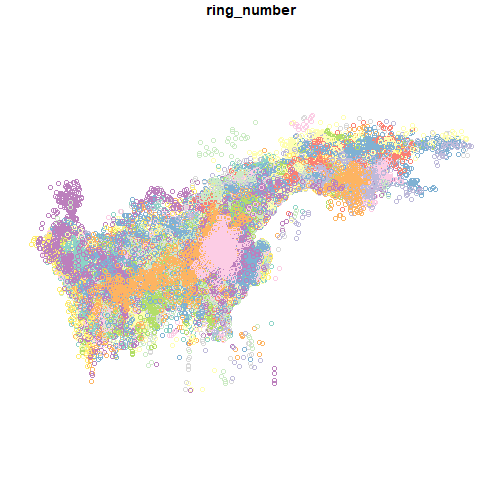

Connecting to the database
=======
Users at NINA and the Polarinstitute (using a computer that is within these networks' IP-addresses) can connect to the Seatrack database. It is a PostgreSQL (9.6) database answering to the address `seatrack.nina.no`, on the standard port 5432. Users should use their individual login user names and passwords. Contact Jens Åström (jens.astrom@nina.no) for details about usernames and passwords.

This instruction deals with the preferred way of connecting to the database, using R and the `seatrackR` package. Another option is to connect through a dedicated database management software, such as Pgadmin3 (or 4), HeidiSQL, or similar. Some users may prefer to use the MS Access interface.


To simplify the connection, use the convenience function `connectSeatrack`. This creates a connection named `con` by using the packages `DBI` and `RPostgres`.


``` r
require(seatrackR)

connectSeatrack(Username = "testreader", Password = "testreader")
```


Custom queries
==============
As of now, 4 functions exist to retreive data from the database through prebuilt queries. Apart from that, users are free to use their own queries through the functions in `DBI` and `dplyr`, using the connection named `con` made by the `connectSeatrack()`-function.

It is perfecty fine to download data through your own custom queries. Creating interesting queries requires some knowledge about the structure of the database however. Pgadmin3(4) would be a useful tool to get further info on that. For now, we show a simple query involving just one table. Here we get the different locations currently recorded from the Faroe Islands (Coordinates not updated).  Note that you have to load the `DBI` package and use its query functions.


``` r
require(DBI)

myQuery <- "SELECT * from metadata.location
              WHERE colony_int_name = 'Faroe Islands'"

faroeLocations <- dbGetQuery(con, myQuery)
head(faroeLocations)
```

```
##                                     id        location_name colony_int_name
## 1 b8136dfe-0bf0-11e8-82b0-005056b165f3   Sydrugøtu grotbrot   Faroe Islands
## 2 b8140854-0bf0-11e8-82b0-005056b165f3 Sydrugøtu waterfront   Faroe Islands
## 3 b8161d4c-0bf0-11e8-82b0-005056b165f3            Vestmanna   Faroe Islands
## 4 b8121e18-0bf0-11e8-82b0-005056b165f3                Sundi   Faroe Islands
## 5 b7e1f8fa-0bf0-11e8-82b0-005056b165f3           Glyvursnes   Faroe Islands
## 6 b7e67e98-0bf0-11e8-82b0-005056b165f3          Havnardalur   Faroe Islands
##   colony_nat_name   lat    lon
## 1         Føroyar 61.95 -6.798
## 2         Føroyar 61.95 -6.798
## 3         Føroyar 61.95 -6.798
## 4         Føroyar 61.95 -6.798
## 5         Føroyar 61.95 -6.798
## 6         Føroyar 61.95 -6.798
##                                                 geom
## 1 0101000020E6100000FED478E926311BC09A99999999F94E40
## 2 0101000020E6100000FED478E926311BC09A99999999F94E40
## 3 0101000020E6100000FED478E926311BC09A99999999F94E40
## 4 0101000020E6100000FED478E926311BC09A99999999F94E40
## 5 0101000020E6100000FED478E926311BC09A99999999F94E40
## 6 0101000020E6100000FED478E926311BC09A99999999F94E40
```


Position data
===============
The primary data of the positions of the birds is stored in the table `positions.postable`. This includes all entered positions in the database. 

The `getPosdata` function retrieves this table, with options to subselect only specific species, colonies, responsible contact person, specific ring numbers, and years. There is also an option to limit the records to a set number of rows, and to load the position coordinates as a spatial object.


``` r
eynhallowPositions <- getPositions(colony = "Eynhallow", loadGeometries = TRUE)
eynhallowPositions
```

```
## Simple feature collection with 183671 features and 33 fields
## Geometry type: POINT
## Dimension:     XY
## Bounding box:  xmin: -67.63588 ymin: 33.60978 xmax: 81.41287 ymax: 82.72977
## Geodetic CRS:  WGS 84
## First 10 features:
##                                      id           date_time logger_id
## 1  a44b5db8-51c0-11f0-a694-005056b165f3 2021-06-23 12:19:49     14209
## 2  a44b6056-51c0-11f0-a694-005056b165f3 2021-06-24 00:19:34     14209
## 3  a44b629a-51c0-11f0-a694-005056b165f3 2021-06-24 12:19:54     14209
## 4  a44b64ca-51c0-11f0-a694-005056b165f3 2021-06-25 00:21:08     14209
## 5  a44b68e4-51c0-11f0-a694-005056b165f3 2021-06-25 12:36:46     14209
## 6  a44b6b3c-51c0-11f0-a694-005056b165f3 2021-06-26 00:37:40     14209
## 7  a44b6e5c-51c0-11f0-a694-005056b165f3 2021-06-26 12:28:04     14209
## 8  a44b7096-51c0-11f0-a694-005056b165f3 2021-06-27 00:15:39     14209
## 9  a44b72d0-51c0-11f0-a694-005056b165f3 2021-06-27 12:09:19     14209
## 10 a44b755a-51c0-11f0-a694-005056b165f3 2021-06-28 00:13:38     14209
##    logger_model year_tracked       session_id  individ_id deployment_date
## 1        mk3006      2021_22 B4282_2021-06-15 GBT_FH89135      2021-06-17
## 2        mk3006      2021_22 B4282_2021-06-15 GBT_FH89135      2021-06-17
## 3        mk3006      2021_22 B4282_2021-06-15 GBT_FH89135      2021-06-17
## 4        mk3006      2021_22 B4282_2021-06-15 GBT_FH89135      2021-06-17
## 5        mk3006      2021_22 B4282_2021-06-15 GBT_FH89135      2021-06-17
## 6        mk3006      2021_22 B4282_2021-06-15 GBT_FH89135      2021-06-17
## 7        mk3006      2021_22 B4282_2021-06-15 GBT_FH89135      2021-06-17
## 8        mk3006      2021_22 B4282_2021-06-15 GBT_FH89135      2021-06-17
## 9        mk3006      2021_22 B4282_2021-06-15 GBT_FH89135      2021-06-17
## 10       mk3006      2021_22 B4282_2021-06-15 GBT_FH89135      2021-06-17
##    retrieval_date ring_number country_code         species    colony   lon_raw
## 1      2022-06-01     FH89135          GBT Northern fulmar Eynhallow -4.380698
## 2      2022-06-01     FH89135          GBT Northern fulmar Eynhallow -4.291339
## 3      2022-06-01     FH89135          GBT Northern fulmar Eynhallow -4.347963
## 4      2022-06-01     FH89135          GBT Northern fulmar Eynhallow -4.628326
## 5      2022-06-01     FH89135          GBT Northern fulmar Eynhallow -8.512228
## 6      2022-06-01     FH89135          GBT Northern fulmar Eynhallow -8.709984
## 7      2022-06-01     FH89135          GBT Northern fulmar Eynhallow -6.285175
## 8      2022-06-01     FH89135          GBT Northern fulmar Eynhallow -3.151895
## 9      2022-06-01     FH89135          GBT Northern fulmar Eynhallow -1.545966
## 10     2022-06-01     FH89135          GBT Northern fulmar Eynhallow -2.596462
##     lat_raw       lon      lat eqfilter    sex age_deployment col_lon col_lat
## 1  58.49406 -4.281711 58.47849     TRUE female  adult_unknown  -3.115  59.142
## 2  58.52893 -4.327839 58.52735     TRUE female  adult_unknown  -3.115  59.142
## 3  58.55747 -4.403921 58.53352     TRUE female  adult_unknown  -3.115  59.142
## 4  58.49011 -5.521901 58.77193     TRUE female  adult_unknown  -3.115  59.142
## 5  59.53326 -7.583115 59.26862     TRUE female  adult_unknown  -3.115  59.142
## 6  59.50188 -8.051732 59.35962     TRUE female  adult_unknown  -3.115  59.142
## 7  58.89673 -6.110182 59.25882     TRUE female  adult_unknown  -3.115  59.142
## 8  59.71033 -3.537622 59.42004     TRUE female  adult_unknown  -3.115  59.142
## 9  59.34131 -2.209440 59.37146     TRUE female  adult_unknown  -3.115  59.142
## 10 59.09263 -2.076425 59.09146     TRUE female  adult_unknown  -3.115  59.142
##                 tfirst             tsecond twl_type sun light_threshold
## 1  2021-06-23 02:25:59 2021-06-23 22:13:39        1  -4               9
## 2  2021-06-23 22:13:39 2021-06-24 02:25:29        2  -4               9
## 3  2021-06-24 02:25:29 2021-06-24 22:14:19        1  -4               9
## 4  2021-06-24 22:14:19 2021-06-25 02:27:56        2  -4               9
## 5  2021-06-25 02:27:56 2021-06-25 22:45:36        1  -4               9
## 6  2021-06-25 22:45:36 2021-06-26 02:29:44        2  -4               9
## 7  2021-06-26 02:29:44 2021-06-26 22:26:25        1  -4               9
## 8  2021-06-26 22:26:25 2021-06-27 02:04:52        2  -4               9
## 9  2021-06-27 02:04:52 2021-06-27 22:13:46        1  -4               9
## 10 2021-06-27 22:13:46 2021-06-28 02:13:29        2  -4               9
##          analyzer data_responsible data_version last_updated     updated_by
## 1  Ida Ward Myran    Paul Thompson           75   2025-10-23 seatrack_admin
## 2  Ida Ward Myran    Paul Thompson           75   2025-10-23 seatrack_admin
## 3  Ida Ward Myran    Paul Thompson           75   2025-10-23 seatrack_admin
## 4  Ida Ward Myran    Paul Thompson           75   2025-10-23 seatrack_admin
## 5  Ida Ward Myran    Paul Thompson           75   2025-10-23 seatrack_admin
## 6  Ida Ward Myran    Paul Thompson           75   2025-10-23 seatrack_admin
## 7  Ida Ward Myran    Paul Thompson           75   2025-10-23 seatrack_admin
## 8  Ida Ward Myran    Paul Thompson           75   2025-10-23 seatrack_admin
## 9  Ida Ward Myran    Paul Thompson           75   2025-10-23 seatrack_admin
## 10 Ida Ward Myran    Paul Thompson           75   2025-10-23 seatrack_admin
##                          geom date_time_downloaded
## 1  POINT (-4.281711 58.47849)  2025-11-17 13:45:30
## 2  POINT (-4.327839 58.52735)  2025-11-17 13:45:30
## 3  POINT (-4.403921 58.53352)  2025-11-17 13:45:30
## 4  POINT (-5.521901 58.77193)  2025-11-17 13:45:30
## 5  POINT (-7.583115 59.26862)  2025-11-17 13:45:30
## 6  POINT (-8.051732 59.35962)  2025-11-17 13:45:30
## 7  POINT (-6.110182 59.25882)  2025-11-17 13:45:30
## 8  POINT (-3.537622 59.42004)  2025-11-17 13:45:30
## 9   POINT (-2.20944 59.37146)  2025-11-17 13:45:30
## 10 POINT (-2.076425 59.09146)  2025-11-17 13:45:30
```


``` r
plot(eynhallowPositions["ring_number"])
```




Position data for export
==================
The data sent to the Polar institute also have the subspecies names added to the records. The export ready positions data can be retrieved most easily through a specific export view. Note that this will download all records, and will take some time. Note that this export does not contain information on the used and deleted uuids. 


``` r
newExport <- dbReadTable(con, Id(schema = "views", table = "export"))
nrow(newExport)
write.csv(newExport, file = "seatrack_export_2018-08-09.csv")
```

If you are interested in knowing separate old, deleted rows, these are found in the table `positions.deleted_uuid`.


``` r
deletedUuids <- dbReadTable(con, Id(schema = "positions", table = "deleted_uuid"))
nrow(deletedUuids)
write.csv(deletedUuids, file = "deletedUuids_2018-08-09.csv")
```


Other functions for download
================
There are some more convenience functions for retrieving information from the database as well. Here follows a quich demo. 

The `getFileArchiveSummary` function
--------------
This function pulls together data from several tables with focus on the file archive. It should contain enough information to know what the individual raw files contain.


``` r
eynhallowFiles <- getFileArchiveSummary(selectColony = "Eynhallow")
```

```
## Error in getFileArchiveSummary(selectColony = "Eynhallow"): unused argument (selectColony = "Eynhallow")
```

``` r
eynhallowFiles
```

```
## Error: object 'eynhallowFiles' not found
```


The `getIndividInfo` function
-------------
This function summarizes all observation data for the individual birds. We can subselect the colony and year interval the bird where tracked.


``` r
hornoyaIndivids <- getIndividInfo(selectColony = "Hornoya", selectYear = "2014_15")
```

```
## Error in getIndividInfo(selectColony = "Hornoya", selectYear = "2014_15"): unused arguments (selectColony = "Hornoya", selectYear = "2014_15")
```

``` r
hornoyaIndivids
```

```
## Error: object 'hornoyaIndivids' not found
```

!Note the weird duplicate records here! **TO BE FIXED**


``` r
hornoyaIndivids %>%
    print(width = Inf)
```

```
## Error: object 'hornoyaIndivids' not found
```


Commonly used info
-------------
I have made a couple of views for som common information, that are displayed on the shiny app http://view.nina.no/seatrack/. These can be found like this as well.


``` r
shorttable <- dbReadTable(con, Id(schema = "views", table = "shorttable"))
shorttable
```

```
##   Antall.arter Antall.kolonier Antall.år Antall.positions Antall.individer
## 1           17             100       104          7525519             7427
##   Antall.tracks..year_tracked.
## 1                          104
```

``` r
shorttableeqfilter3 <- dbReadTable(con, Id(schema = "views", table = "shorttableeqfilter3"))
shorttableeqfilter3
```

```
##   Antall.arter Antall.kolonier Antall.år Antall.positions Antall.individer
## 1           17             100       104          5574341             7427
##   Antall.tracks..year_tracked.
## 1                          104
```


